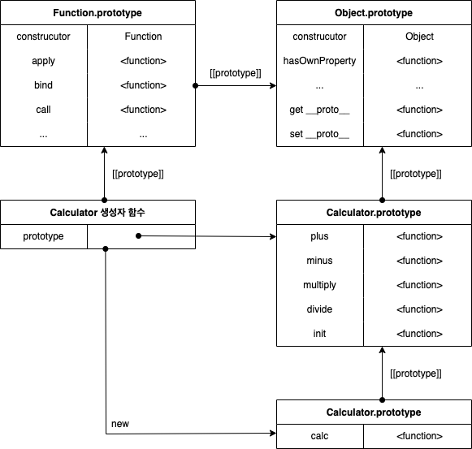

# 3주차 과제

# 과제

1. var, let 의 차이점과, 변수 호이스팅에 대한 설명
    - var
        - var 변수는 소스코드의 실행 과정 이전에 undefined로 값이 할당된다.
        - 변수 호이스팅: 소스코드의 최상단에 선언된 것 처럼 사용할 수 있다.
    - let
        - let 변수는 소스코드의 실행 과정 이전에 <uninitialized> 가 할당된다.
        - 따라서 let 변수 또한 변수 호이스팅이 일어나지만 <uninitialized>가 할당 되어있어 실행 중 선언문을 만나기 전까지 사용할 수 있다.(이러한 현상을 Temporal Dead Zone 이라고 부른다.)
    
2. 생성자 함수 `Accumulator(startingValue)`를 만들어 보세요.
    
    `Accumulator(startingValue)`를 이용해 만드는 객체는 아래와 같은 요건을 충족해야 합니다.
    
    - 프로퍼티 `value`에 현재 값(current value)을 저장합니다. 최초 호출 시엔 생성자 함수의 인수, `startingValue`에서 시작값(starting value)을 받아옵니다.
    - 메서드 `read()`에선 `prompt` 함수를 사용해 사용자로부터 숫자를 받아오고, 받은 숫자를 `value`에 더해줍니다.
    - new를 호출하지 않아도 함수가 정상적으로 동작해야 됩니다.

프로퍼티 `value`엔 `startingValue`와 사용자가 입력한 모든 값의 총합이 더해져 저장됩니다.

데모를 위한 코드는 다음과 같습니다.

```jsx
function Accumulator(value = 0) {
	if(!new.target) { // new 연산자로 함수가 호출되지 않았을 경우
  	return new Accumulator(value); // new 연산자와 함께 반환해준다.
  }

	this.value = value;
	this.read = function () {
  	this.value += +prompt("value?", 0);
	};

}

let accumulator = new Accumulator(1); // 최초값: 1
let accumulator2 = Accumulator(2); // 최초값: 2

accumulator.read(); // 사용자가 입력한 값을 더해줌
accumulator.read(); // 사용자가 입력한 값을 더해줌

accumulator2.read(); // 사용자가 입력한 값을 더해줌
accumulator2.read(); // 사용자가 입력한 값을 더해줌

alert(accumulator.value); // 최초값과 사용자가 입력한 모든 값을 더해 출력함
alert(accumulator2.value); // 최초값과 사용자가 입력한 모든 값을 더해 출력함
```

출처: ko.javascript.info

1. 프로토타입을 기반(상속을 통해 불필요한 중복을 제거)으로 한 계산기 생성자 함수 Calculator(startingValue)를 만들어주세요
- 덧셈, 뺄셈, 곱셈, 나눗셈이 가능해야 됨

```jsx
const Calculator = function (value = 0) { // value 매개변수를 받지 못했을 경우 0 할당
	this.value = value;
  
  Calculator.prototype.add = function(a) { // 프로토타입 메서드
  	this.value += a;
	};
  
  Calculator.prototype.minus = function(a) {
  	this.value -= a;
  };
  
  Calculator.prototype.multiply = function(a) {
  	this.value *= a;
  };
  
  Calculator.prototype.divide = function(a) {
  	this.value /= a;
  };
  
  Calculator.prototype.init = function() {
  	this.value = 0;
  };

}

const calc = new Calculator(3);

calc.add(5);
console.log(calc.value); // 8

calc.minus(1);
conosole.log(calc.value); // 7

calc.multiply(3);
console.log(calc.value); // 21

calc.divide(7);
console.log(calc.value); // 3

calc.init();
console.log(calc.value); // 0
```

 3-1. 위 코드의 구조를 그림으로 표현해주세요(프로토타입 포함)

- 그림
    
    

1. 오버라이딩과 프로퍼티 섀도잉을 사용한 코드를 자유롭게 작성해주세요
- 오버라이딩이 어디서 사용됐는지 주석으로 남겨주세요!

```jsx
function Me() {
	Me.prototype.eat = function () { // 프로토타입 메서드
  	console.log("eat everyday");
  };
  
	Me.prototype.sleep = function() { // 프로토타입 메서드
  	console.log("sleep allday");
  };
  
}

const me = new Me();

me.eat = function() { // 인스턴스 메서드로 인해 프로토타입 메서드가 가려진다. (overriding)
	console.log("never eat");
}

me.eat();
```
