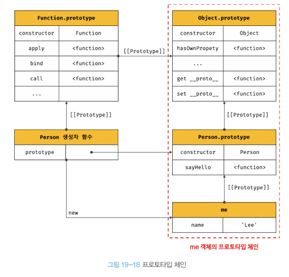
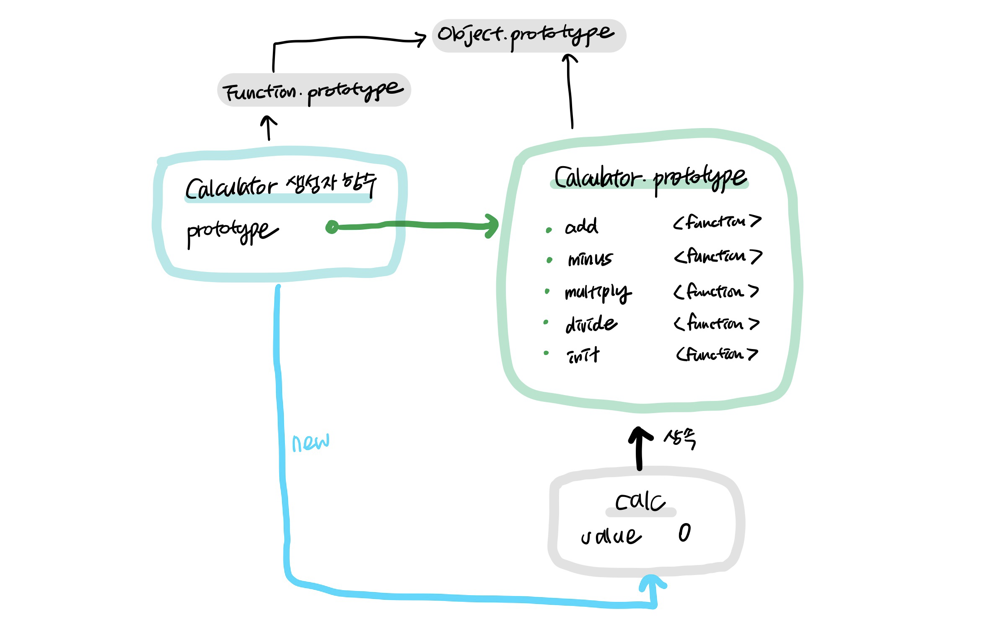

# [과제] deep dive 스터디 3주차 과제 (5/2 ~ 5/8)

# 범위

- 15장 let, const 키워드와 블록 레벨 스코프 ~ 20장 strict mode
  (p208 ~ p319)

# 과제

## 문제 01

1. var, let 의 차이점과, 변수 호이스팅에 대한 설명
   - var: 함수 레벨 스코프, 재선언, 재할당 가능
   - let: 블록 레벨 스코프, 재할당 가능
   - 호이스팅: 해당 스코프의 최상단으로 끌어올려지는 현상
     - var 키워드로 선언된 변수는 호이스팅되며 선언과 초기화(undefined)가 동시에 일어난다.
     - let 키워드로 선언된 변수는 호이스팅에 의해 선언되지만, 값이 할당되기 전까지 초기화되지 않으므로 TDZ(Temporal Dead Zone) 구간에 의해 마치 호이스팅되지 않는 것처럼 보인다.

## 문제 02

2. 생성자 함수 `Accumulator(startingValue)`를 만들어 보세요.

   `Accumulator(startingValue)`를 이용해 만드는 객체는 아래와 같은 요건을 충족해야 합니다.

   - 프로퍼티 `value`에 현재 값(current value)을 저장합니다. 최초 호출 시엔 생성자 함수의 인수, `startingValue`에서 시작값(starting value)을 받아옵니다.
   - 메서드 `read()`에선 `prompt` 함수를 사용해 사용자로부터 숫자를 받아오고, 받은 숫자를 `value`에 더해줍니다.
   - new를 호출하지 않아도 함수가 정상적으로 동작해야 됩니다.

프로퍼티 `value`엔 `startingValue`와 사용자가 입력한 모든 값의 총합이 더해져 저장됩니다.

데모를 위한 코드는 다음과 같습니다.

```jsx
let accumulator = new Accumulator(1); // 최초값: 1
let accumulator2 = Accumulator(2); // 최초값: 2

accumulator.read(); // 사용자가 입력한 값을 더해줌
accumulator.read(); // 사용자가 입력한 값을 더해줌

accumulator2.read(); // 사용자가 입력한 값을 더해줌
accumulator2.read(); // 사용자가 입력한 값을 더해줌

alert(accumulator.value); // 최초값과 사용자가 입력한 모든 값을 더해 출력함
alert(accumulator2.value); // 최초값과 사용자가 입력한 모든 값을 더해 출력함
```

### 풀이

```jsx
function Accumulator(StartingValue) {
  this.value = StartingValue;

  this.read = function () {
    const input = window.prompt("write a number");
    this.value += input;
  };
}
```

## 문제 03

3. 프로토타입을 기반(상속을 통해 불필요한 중복을 제거)으로 한 계산기 생성자 함수 Calculator(startingValue)를 만들어주세요

- 덧셈, 뺄셈, 곱셈, 나눗셈이 가능해야 됨

```jsx
const calc = new Calculator(3);

calc.add(5);
console.log(calc.value); // 8

calc.minus(1);
conosole.log(calc.value); // 7

calc.multiply(3);
console.log(calc.value); // 21

calc.divide(7);
console.log(calc.value); // 3

calc.init();
console.log(calc.value); // 0
```

### 풀이

```jsx
function Calculator(init) {
  this.value = init;
}

Calculator.prototype.add = function (num) {
  this.value += num;
};
Calculator.prototype.minus = function (num) {
  this.value -= num;
};
Calculator.prototype.multiply = function (num) {
  this.value *= num;
};
Calculator.prototype.divide = function (num) {
  this.value /= num;
};
Calculator.prototype.init = function () {
  this.value = 0;
};

const calc = new Calculator(3);

calc.add(5);
console.log(calc.value); // 8

calc.minus(1);
console.log(calc.value); // 7

calc.multiply(3);
console.log(calc.value); // 21

calc.divide(7);
console.log(calc.value); // 3

calc.init();
console.log(calc.value); // 0
```

3-1. 위 코드의 구조를 그림으로 표현해주세요(프로토타입 포함)

- 예시(아래 그림)
  

### 풀이



## 문제 04

4. 오버라이딩과 프로퍼티 섀도잉을 사용한 코드를 자유롭게 작성해주세요

### 풀이

```jsx
const Movie = (function () {
  function Movie(title, director = undefined, year = undefined) {
    this.title = title;
    this.director = director;
    this.year = year;
  }

  Movie.prototype.printInfo = function () {
    console.log(`${this.title}(${this.year ?? "-"}) - ${this.director}`);
  };
  return Movie;
})();

const movie = new Movie("Avengers", "Sohui", "2100");
movie.printInfo();

movie.printInfo = function () {
  console.log(
    `${this.title}(${this.year ?? "-"}) is written by ${this.director}`
  );
};
movie.printInfo();
```
