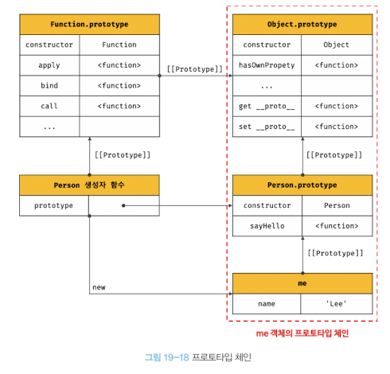

# 3주차_과제_심세현

# 범위

- 15장 let, const 키워드와 블록 레벨 스코프 ~ 20장 strict mode
(p208 ~ p319)

# 과제

1. var, let 의 차이점과, 변수 호이스팅에 대한 설명

- 변수 호이스팅
    - 변수 호이스팅은 변수가 스코프 상단으로 이동 한 것처럼 느껴지는 현상.
    - 자바스크립트가 한 줄씩 코드를 실행하기 전에 변수만 따로 메모리 공간에 저장하는 과정을 걷히고, 그다음에 한줄 한줄 코드를  해석하고 실행시킨다.
    - 다른 코드들 보다 변수가 메모리 공간에 먼저 할당이 되기 때문에 변수 선언이 위에 간 것 같은 현상이 나타난다.
    - 이때 var로 선언된 변수는 호이스팅 단계에서 undefined로 초기화 되고, let과 const로 선언된 변수는 나중에 변수 선언부에서 초기화가 일어난다.(const, let으로 선언된 변수들도 호이스팅이 일어나긴 한다. )
    - var로 선언된 변수는 값이 할당이 일어나기 전에 undefined로 값이 초기화 된다.
    - const, let 으로 선언된 변수들도 호이스팅이 일어나서 메모리 공간에 다른 코드를 읽기 전에 적재되지만, 값이 초기화 되지는 않는다.
    

- var 와 let의 차이점
    - let은 재선언 불가능, var은 재선언이 가능함.
    - var로 선언된 변수는 값이 할당 되기 전에 undefined로 값이 초기화 되어 있다.
    
    ```jsx
    
    // 변수 호이스팅은 변수가 스코프 최상단으로 이동 한 것처럼 느껴지는 현상.(명백히는 최상단으로 이동하지는 않는다.)
    // 자바스크립트 엔진이 변수 선언은 아랫쪽에 위치하더라도 상관없이 다른 코드들보다 변수를 먼저 읽어드리기 때문에 일어나는 현상
    // 호이스팅시 값의 할당과 초기화는 일어나지 않는다. 변수 선언부에서 초기화가 이루어지고, 할당이 일어나는 코드에서 값이 할당 된다.
    // var로 선언된 변수는 예외적으로 undefined로 초기화된다.
    //var myName = undefined;
    
    // let은 재할당은 가능하지만, 재선언은 불가능
    console.log(myName) //myName is not defined
    let cardName = 'KB';
    cardName = '카카오'; // 재할당 가능
    let cardName = 'IBK'; //has already been declared, 재선언 불가능
    
    //var로 선언된 변수는 재선언도 가능함.
    // 값이 할당 되기도 전에 호이스팅 단계에서 undefined로 값 초기화가 일어남.
    console.log(myName) // undefined
    var myName = '박민수';
    myName = '이민수'; // 재할당 가능
    var myName = '김민수'; // 재선언 가능
    
    ```
    

1. 생성자 함수 `Accumulator(startingValue)`를 만들어 보세요.
    
    `Accumulator(startingValue)`를 이용해 만드는 객체는 아래와 같은 요건을 충족해야 합니다.
    
    - 프로퍼티 `value`에 현재 값(current value)을 저장합니다. 최초 호출 시엔 생성자 함수의 인수, `startingValue`에서 시작값(starting value)을 받아옵니다.
    - 메서드 `read()`에선 `prompt` 함수를 사용해 사용자로부터 숫자를 받아오고, 받은 숫자를 `value`에 더해줍니다.
    - new를 호출하지 않아도 함수가 정상적으로 동작해야 됩니다.

프로퍼티 `value`엔 `startingValue`와 사용자가 입력한 모든 값의 총합이 더해져 저장됩니다.

데모를 위한 코드는 다음과 같습니다.

```jsx
function Accumulator(startingValue){

    if(!new.target){
        return new  Accumulator(startingValue);
    } // new 없이 일반 함수로 호출된 함수는 인스턴스로 반환시킨다.
    
		this.value = startingValue;
    this.read = function(){
        this.value += +prompt("저장 된 값에 입력하신 숫자를 더합니다."); 
    }
}
let accumulator = new Accumulator(1); // 최초값: 1
let accumulator2 = Accumulator(2); // 최초값: 2

accumulator.read(); // 사용자가 입력한 값을 더해줌
accumulator.read(); // 사용자가 입력한 값을 더해줌

accumulator2.read(); // 사용자가 입력한 값을 더해줌
accumulator2.read(); // 사용자가 입력한 값을 더해줌

alert(accumulator.value); 
alert(accumulator2.value); 
```

출처: ko.javascript.info

1. 프로토타입을 기반(상속을 통해 불필요한 중복을 제거)으로 한 계산기 생성자 함수 Calculator(startingValue)를 만들어주세요
- 덧셈, 뺄셈, 곱셈, 나눗셈이 가능해야 됨

```jsx
function Operators(){
    this.add = function (value){
        this.value += +value;
    }
     this.minus = function (value){
        this.value -= value;
    }
     this.multiply = function (value){
        this.value *= value;
    }
     this.divide = function (value){
        this.value /= value;
    }
     this.init = function (value){
        this.value = 0 ;
     }
}

function Calculator(value){
    this.value = value
}

Calculator.prototype = new Operators();

const calc = new Calculator(3);

calc.add(5);
console.log(calc.value); // 8

calc.minus(1);
console.log(calc.value); // 7

calc.multiply(3);
console.log(calc.value); // 21

calc.divide(7);
console.log(calc.value); // 3

calc.init();
console.log(calc.value); // 0
```

 3-1. 위 코드의 구조를 그림으로 표현해주세요(프로토타입 포함)


- 프로토타입 예시 그림
    
    
    
1. 오버라이딩과 프로퍼티 섀도잉을 사용한 코드를 자유롭게 작성해주세요

- 오버라이딩(overriding)
    - 상속되어 있는 상위의 객체 프로퍼티를 재정의하여 사용 하는 것
    - 하위 객체에서 상위 객체의 메소드를 재정의 해서 사용해도 사용해도 일어나도 상위의 객체 메서드는 변경 되지 않는다.
    - 하위 객체에서 변경한 메소드에 의해 상위 객체의 메소드는 가려지게 된다. 이것이 쉐도잉(shadowing)이다.
    

```jsx
function Operators(){
    this.add = function (value){
        this.value += value;
    }
     this.minus = function (value){
        this.value -= value;
    }
     this.multiply = function (value){
        this.value *= value;
    }
     this.divide = function (value){
        this.value /= value;
    }
     this.init = function (value){
        this.value = 1 ;
     }// 쉐도잉, 재정의된 calc.init에 의해 가려지게 된다
}

function Calculator(value){
    this.value = value
}

Calculator.prototype = new Operators();

const calc = new Calculator(3);

calc.init = function(){
	this.value = 0;
} // 오버라이딩, init 메소드를 하위의 객체에서 재정의

calc.add(23);
console.log(calc.value); //26

calc.init();
console.log(calc.value); //1
console.log(Calculator.prototype.init) // ƒ (value){this.value = 1;}

delete calc.init;
calc.init();
console.log(calc.value); //0

```

**공부 하시면서 중간에 이해가 되지 않는 부분을 페이지와 함께 댓글로 남겨주시면, 스터디원 분들께서 답변을 
남겨주셨으면 좋겠습니다!**